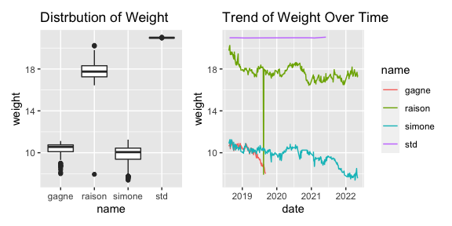

p8105_mtp_zz2780
================
Lydia Zhang
2022-10-20

Word Count: 495

Importing Data

``` r
data=read_excel("data/dogweights_07may2022.xlsx", range="B2:F363" )
```

The raw data has 5 variables and 361 observations. Under the columns
Raison, Simone, Gagne are the weights recorded for each dog; std
represents the standard object’s weight. Some dates contain notes
recorded that day. The goal of this report is to tidy the dataset,
conduct descriptive analysis, and produce graphic outputs for the
distribution of each dog’s weight and their trends over time.

For the first dataframe, I imported the table and omitted the Notes
section. After cleaning columns’ names, I realized that recorded weights
contained two values, one in lb and one in oz, separated by space. After
separating the two numbers for each dog into two and converting them
into numeric variables, I combined the two weight values with same unit
in lb for each dog and the standard object. Then I dropped all the
intermediate variables and only kept weights in lbs for Raison, Simone,
Gagne, their std, and the dates recorded.

Since the column names of dogs and standard object should also be a
variable, I pivoted the table, changing column names to variable called
Name, including values Raisin, Simone, Gagne, and std, and the second
variable Weight with each object’s weight recorded on that date. After
dropping all NA values, I converted the numeric values of dates to
modern date format. The first data frame is exported with the name
“dataframe1.csv” in the data folder along with the raw data.

``` r
data1<-data%>%
  janitor::clean_names() %>%
  separate(col=raisin, into=c("raison_lb", "raison_oz"), sep=" ")%>%
  separate(col=simone, into=c("simone_lb", "simone_oz"), sep=" ")%>%
  separate(col=gagne, into=c("gagne_lb", "gagne_oz"), sep=" ")%>%
  separate(col=std, into=c("std_lb", "std_oz"), sep=" ")%>%
  transform(
            raison_lb=as.numeric(raison_lb),
            raison_oz=as.numeric(raison_oz),
            simone_lb=as.numeric(simone_lb),
            simone_oz=as.numeric(simone_oz),
            gagne_lb=as.numeric(gagne_lb),
            gagne_oz=as.numeric(gagne_oz),
            std_lb=as.numeric(std_lb),
            std_oz=as.numeric(std_oz)
  )%>%
  mutate(
    raison=round(raison_lb+0.0625*raison_oz,2),
    simone=round(simone_lb+0.0625*simone_oz,2),
    gagne=round(gagne_lb+0.0625*gagne_oz,2),
    std=round(std_lb+0.0625*std_oz,2)
  )%>%
  select(date, raison, simone, gagne, std)%>%
  pivot_longer(
    raison:std,
    names_to="name",
    values_to="weight"
  )%>%
  na.omit()

data1$date=excel_numeric_to_date(as.numeric(data1$date), date_system="modern")

write.csv(data1, "data/dataframe1.csv", row.names=FALSE)
```

The second data frame was selected from the same excel sheet. After
cleaning the name, I copied the column of notes and gave the new column
name “Notes”. I also changed the numeric date format to modern format.
And I only selected variables date and Notes, removing all NA values. I
exported the second data frame as “dataframe2.csv” to the data folder.

``` r
data2=read_xlsx("data/dogweights_07may2022.xlsx", range="B2:G363" )%>%
  janitor::clean_names()%>%
  mutate(Notes=x6,
         date=excel_numeric_to_date(as.numeric(date), date_system="modern")
         )%>%
  select(date, Notes)%>%
  na.omit()
```

    ## New names:
    ## • `` -> `...6`

``` r
write.csv(data2, "data/dataframe2.csv", row.names=FALSE)
```

EDA

The resulting tidy dataframe1 contains 852 observations and 3
observations. Variables are recorded date, dog’s name, and corresponding
weight.

``` r
data1%>%
  count(date, name="n_obs")%>%
  na.omit()
```

    ## # A tibble: 356 × 2
    ##    date       n_obs
    ##    <date>     <int>
    ##  1 2018-08-12     3
    ##  2 2018-08-19     4
    ##  3 2018-08-22     4
    ##  4 2018-08-24     4
    ##  5 2018-08-27     4
    ##  6 2018-08-29     4
    ##  7 2018-08-31     4
    ##  8 2018-09-02     4
    ##  9 2018-09-03     4
    ## 10 2018-09-04     4
    ## # … with 346 more rows

356 distinct dates are include in the dataset.

The table below recorded the number of observations for each dog, their
average weight and standard deviation.

``` r
table1<-data1%>%
  group_by(name)%>%
  na.omit()%>%
  summarize(
    n_obs=n(),
    avg_weight=round(mean(weight),2),
    sd_weight=round(sd(weight),2)
  )
head(table1)
```

    ## # A tibble: 4 × 4
    ##   name   n_obs avg_weight sd_weight
    ##   <chr>  <int>      <dbl>     <dbl>
    ## 1 gagne    119      10.3       0.71
    ## 2 raison   352      17.8       0.94
    ## 3 simone   333       9.79      0.92
    ## 4 std       45      21.0       0.01

Visualization

``` r
plot1<-data1%>%
  ggplot(aes(x=name, y=weight))+
  geom_boxplot()+
  labs(title="Distrbution of Weight")

plot2<-data1%>%
  na.omit()%>%
   ggplot(aes(x=date,y=weight))+
  geom_line(aes(color=name))+
  labs(title="Trend of Weight Over Time")

plot<-plot1 | plot2
plot
```



``` r
ggsave("results/Weight_plot.pdf",plot, width=13, height=7)
```

The weight distrbution of Gagne and Simone is very similar. Their
average weights are both a little above 10lb. Simone has more weight
records below 10lb than Gagne does. Raison’s average weight is almost
18lb. The weight of standard object remains constant with some
measurement errors.

For the time trend plot, I can observe that Gagne does not have any
record after late-2019, and I learned from the notes that Gagne died on
09/08/2019. And Simone’s weight is constantly decreasing after 2021, and
from the notes I learned that Simone was diagnosed with neurological
problem on 01/24/2021, which could explain the weight decreasing. I can
also observe that Raison’s weight remains constant overtime, but there
is a sudden drop on late-2019, which does not make sense according to
the notes, so I am assuming this is due to record mistake.
